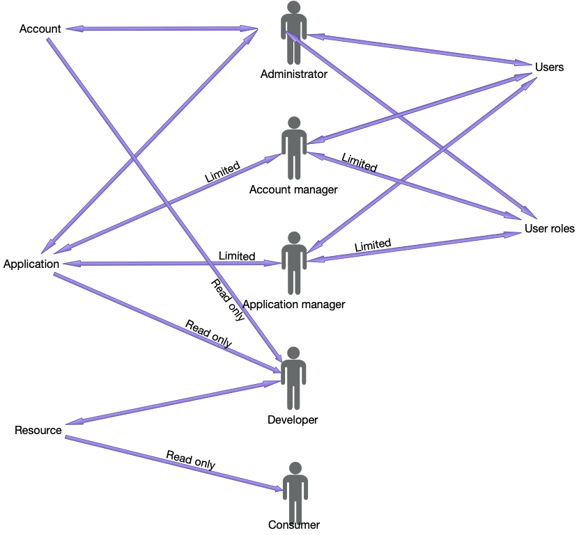
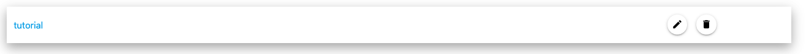
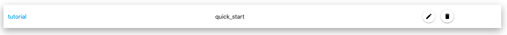
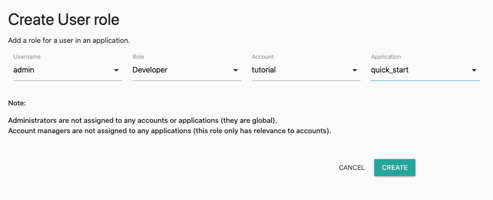
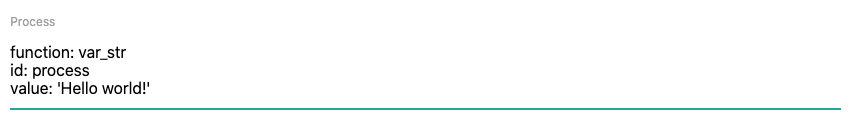

# GaterData

[](https://opensource.org/licenses/MPL-2.0)

GaterData is an open source product, and contributions are welcome.

At heart, GaterData is a complete en d to end REST API solution.

It enables you to generate API's without the need for coding.
API resources are stored in YAML or JSON format,
which include security business logic and multiple outputs of required.

All administrative tools are available via secure API calls.
However, there is also an admin site that you can use to manage your resources.

GaterData has a heirarchical approach to API resources.

* `account` - this defines a top-level entity, like a client.
* `application` - these belong to an account,
   and are used to group API resources, like a department, project or product.
* `resource` - These are individual API definitions that belong to an application.

Each registered user has a role that assigns them specific access rights to the GaterData.
A user that does not have access rights to an account, application or resource cannot use them.

You can create custom roles if you want to further split consumers into groups.

For more information, visit the wiki at [wiki.gaterdata.com](https://wiki.gaterdata.com) or [phpdoc.gaterdata.com](https://phpdoc.gaterdata.com)

# Overview

## How can you define programmatic logic without coding?

Easy - consider that all programming can be reduced down to semantic blocks, like:

* get a data block
* for each element
    * do this
    * if that
        * do something
    * else
        * do something else
* do another thing
* finish and return result

GaterData has Processors that you use to call each semantic block
and the result of each processor flows into another, like a node tree.

This means that you can define all programmatic logic quickly and easily in a YAML or JSON file.

## Granular access

Access to the GaterData is controlled by user roles.
Although you can also create API resources that do not require user validation,
If you want to create a resource that is open to the general public.

Each registered user must have a role assigned to them

Default roles:

* Administrator
* Account manager
* Application manager
* Developer
* Consumer



## Security

Each Resource has a security section.
This enables you to create user validation on all resources.
This includes:

* bearer token
* token
* oauth

More security strategies are coming.

## Input

GaterData can fetch data from other endpoints,
like API's on a remote, another GaterData resource or a file on a remote server.
These remote endpoints do not need to be completely open:
a resource can be created to use whatever authentication you require on that endpoint.

## API Output

The return result is defined in the `accept` header, i.e.

* application/json
* text/html
* application/xml
* application/plain
* application/octet-stream

So this means that you only need to create an API once, not for each format.
It is up to the client to request whatever format they require.

## Multiple outputs

You can also create multiple output streams to the default response output.
Perhaps you also require an email notification on completion of success or failure of the request,
or want to trigger a process on a remote server.

## Architecture

GaterData is created to cater for distributed or single server (monollithic) architecture.
Docker examples have been created and also example configurations for NGINX or Apache servers.

# Quick start

## Installation

The quickest way to install GaterData is to create a project with composer:

    TODO

Serve the GaterData API and admin through Docker. See the [wiki](https://wiki.gaterdata.com) 

# Hello world

## Requirements

You will need:

* Postman (<a href="https://www.postman.com/downloads/" target="_blank">Download</a>) or similar REST client.

# Create a new account and application

Click on "Accounts" in the menu or navigate to [admin.gaterdata.local/accounts](https://admin.gaterdata.locall/accounts).

Click on the Plus icon:


Name new account: "tutorial"


You have now created a new top level account:



Click on "Applications" in the menu or navigate to [admin.gaterdata.local/applications](https://admin.gaterdata.locall/applications).

Click on the Plus icon to create a new application. Assign the application to the "tutorial" account and call it "quick_start".


You have now created the "quick-start" application that our resource will belong to:



# Configure users and roles

## Create a developer role for the new application

Click on "User Roles" in the menu or navigate to [admin.gaterdata.local/user/roles](https://admin.gaterdata.locall/user/roles).

Click on the plus icon and assign yourself the developer role for Account: tutorial and application: quick_start.



You now have permission to create a resource for the newly created quick_start application.

# Create a "Hello world!" resource

This resource will display "Hello world!" in the result in whatever format the client requires,
and will have security that requires an active token from a user with a developer role.
The authentication method will vbe bearer token.

## Define the resource name, descriptio, and URL

Fill out the following fields in the interface:

* Name: ```Hello world```
    * This is the title of the resource that appears in [admin.gaterdata.local/resources](https://admin.gaterdata.locall/resources).
* Description: ```A quick-start hello world resource```
    * This is the description of the resource that appears in [admin.gaterdata.local/resources](https://admin.gaterdata.locall/resources).
* Account: ```tutorial```
    * This assigns the resource to the account tutorial.
* Application: ```quick_start```
    * This assigns the resource to the application quick_start.
* Method: ```GET```
    * This declares the HTTP method. 
* URI: ```hello/world```
    * This defines the URI fragment for the request that comes after /<account>/<application>/.
8 TTL: 30
    * This gives the resource a cache time of 30 seconds.


So far, we have defined a resource that can be called from (GET) [api.gaterdata.local/tutorial/quick_start/hello/world](https://api.gaterdata.local/tutorial/quick_start/hello/world).

However, it does nothing and has no security yet.

## Define the security

Add the following snippet to the Security section:

    function: token_role
    id: security
    token:
      function: bearer_token
      id: security_token
    role: Developer

This calls the processor ```token_role```.
We're giving the processor an ID name of "security", so that if there are any bugs we can see where the error is in the result.

The ```token_role``` processor requires 2 inpute:

* token - the requesting user's token.
* role - the role to validate the requesting user against.

```token``` will use another processor to pass its result into token_role.
This is ```bearer_token```. This will return the bearer token value from the request header.
We will assign this an ID name of "security_token".

```role``` will not require processing from another processor, because this does not need to be dynamic.
So we're using a static string: "Developer".


## Define the process

Add the following snippet to the Process section:

    function: var_str
    id: process
    value: 'Hello world!'

This will use a single processor: ```var_str```.
This processor returns the value of a strictly typed string.

It's input value does not need to be dynamic here, so we're giving it a static string value.



## Save

Click on the ```Upload``` button.

The resource will be parsed and checked for any error, and saved to the database.

If you navigate back to [admin.gaterdata.local/resources](https://admin.gaterdata.locall/resources),
you should see your new resource.


If you click on the download button in the listing for ```Hello world``` and select YAML format,
it should look like this:

    name: 'Hello world'
    description: 'A quick-start hello world resource'
    uri: hello/world
    method: get
    appid: 2
    ttl: ''
    security:
        function: token_role
        id: security
        token:
            function: bearer_token
            id: security_token
        role: Developer
    process:
        function: var_str
        id: process
        value: 'Hello world'

You can edit and upload this yaml file as you wish.

# Run the new resource

Open up your REST client

## Get a new token for your user

* Method: POST
* URL: https://api.gaterdata.local/gaterdata/core/login
* Header:
    * Accept: application/json
* Body:
    * x-www-form-urlencoded
    * fields:
        * username: <username>
        * password: <password>


The result should be something similar to:

    {
        "token": "13ae430eb19a6651378e22e3a37de8cf",
        "uid": 2
    }

Copy the value for the token.

## Run Hello world!

* Method: GET
* URL: https://api.gaterdata.local/tutorial/quick_start/hello/world
* Header:
    * Accept: application/json
    * Authorization: Bearer <token>

The result should be something similar to:

    "Hello world!"


If we change the Accept value in the header to ```application/xml```,
we will get something similar to:

    <?xml version="1.0"?>
    <gaterdataWrapper>Hello world!</gaterdataWrapper>

# Developers and contributors

GaterData is hosted on both GitHub and Gitlab.

If you want to create a standalone processor that users can include in their composer project,
You can do that in any versioning system you like.
If the processor is really popular, we may ask you for your permission to include this in GaterData core.

If you want to contribute to the GaterData code base, all project development occurs on Gitlab, so you will need to create a GitLab account.
Then create a fork of the project, and submit your changes in a PR.
See [wiki.gaterdata.com](https://wiki.gaterdata.com) for more details.
