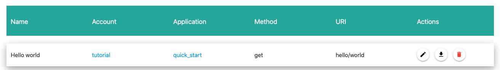
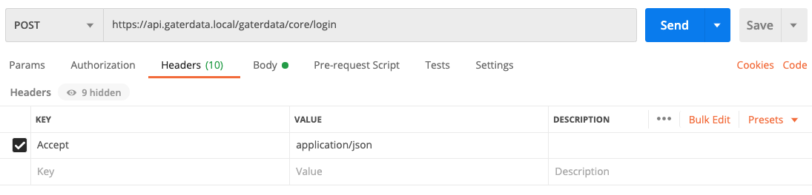
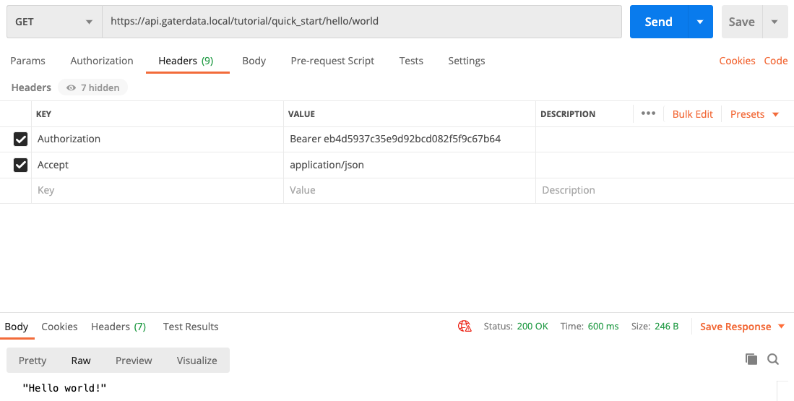

Quick start
===========

Requirements
------------

For this tutorial, you will need:

* An installed ApiOpenStudio project.
    * See <a href="/installation/installation.html" target="_blank">Installing the codebase</a>
    and <a href="/installation/docker/developer-environment.html" target="_blank">Setup docker</a>
* Postman (<a href="https://www.postman.com/downloads/" target="_blank">Download</a>) or similar REST client.

Create a new account and application
------------------------------------

Click on "Accounts" in the menu or navigate to [admin.apiopenstudio.local/accounts](https://admin.apiopenstudio.locall/accounts).

Click on the Plus icon:


Name new account: "tutorial"


You have now created a new top level account:


Click on "Applications" in the menu or navigate to [admin.apiopenstudio.local/applications](https://admin.apiopenstudio.locall/applications).

Click on the Plus icon to create a new application. Assign the application to the "tutorial" account and call it "quick_start".


You have now created the "quick-start" application that our resource will belong to:


Configure users and roles
-------------------------

### Create a developer role for the new application

Click on "User Roles" in the menu or navigate to [admin.apiopenstudio.local/user/roles](https://admin.apiopenstudio.locall/user/roles).

Click on the plus icon and assign yourself the developer role for Account: tutorial and application: quick_start.


You now have permission to create a resource for the newly created quick_start application.

### Create a "Hello world!" resource

This resource will display "Hello world!" in the result in whatever format the client requires,
and will have security that requires an active token from a user with a developer role.
The authentication method will vbe bearer token.

#### Define the resource name, description, and URL

Fill out the following fields in the interface:

* Name: ```Hello world```
    * This is the title of the resource that appears in [admin.apiopenstudio.local/resources](https://admin.apiopenstudio.locall/resources).
* Description: ```A quick-start hello world resource```
    * This is the description of the resource that appears in [admin.apiopenstudio.local/resources](https://admin.apiopenstudio.locall/resources).
* Account: ```tutorial```
    * This assigns the resource to the account tutorial.
* Application: ```quick_start```
    * This assigns the resource to the application quick_start.
* Method: ```GET```
    * This declares the HTTP method. 
* URI: ```hello/world```
    * This defines the URI fragment for the request that comes after /<account>/<application>/.
8 TTL: 30
    * This gives the resource a cache time of 30 seconds.


So far, we have defined a resource that can be called from (GET) [api.apiopenstudio.local/tutorial/quick_start/hello/world](https://api.apiopenstudio.local/tutorial/quick_start/hello/world).

However, it does nothing and has no security yet.

#### Define the security

Add the following snippet to the Security section:

    function: token_role
    id: security
    token:
      function: bearer_token
      id: security_token
    role: Developer

This calls the processor ```token_role```.
We're giving the processor an ID name of "security", so that if there are any bugs we can see where the error is in the result.

The ```token_role``` processor requires 2 inpute:

* token - the requesting user's token.
* role - the role to validate the requesting user against.

```token``` will use another processor to pass its result into token_role.
This is ```bearer_token```. This will return the bearer token value from the request header.
We will assign this an ID name of "security_token".

```role``` will not require processing from another processor, because this does not need to be dynamic.
So we're using a static string: "Developer".


#### Define the process

Add the following snippet to the Process section:

    function: var_str
    id: process
    value: 'Hello world!'

This will use a single processor: ```var_str```.
This processor returns the value of a strictly typed string.

It's input value does not need to be dynamic here, so we're giving it a static string value.


#### Save

Click on the ```Upload``` button.

The resource will be parsed and checked for any error, and saved to the database.

If you navigate back to [admin.apiopenstudio.local/resources](https://admin.apiopenstudio.locall/resources),
you should see your new resource.



If you click on the download button in the listing for ```Hello world``` and select YAML format,
it should look like this:

    name: 'Hello world'
    description: 'A quick-start hello world resource'
    uri: hello/world
    method: get
    appid: 2
    ttl: ''
    security:
        function: token_role
        id: security
        token:
            function: bearer_token
            id: security_token
        role: Developer
    process:
        function: var_str
        id: process
        value: 'Hello world'

You can edit and upload this yaml file as you wish.

### Run the new resource

Open up your REST client

#### Get a new token for your user

* Method: POST
* URL: https://api.apiopenstudio.local/apiopenstudio/core/login
* Header:
    * Accept: application/json
* Body:
    * x-www-form-urlencoded
    * fields:
        * username: <username>
        * password: <password>




The result should be something similar to:

    {
        "token": "13ae430eb19a6651378e22e3a37de8cf",
        "uid": 2
    }

Copy the value for the token.

#### Run Hello world!

* Method: GET
* URL: https://api.apiopenstudio.local/tutorial/quick_start/hello/world
* Header:
    * Accept: application/json
    * Authorization: Bearer <token>

The result should be something similar to:

    "Hello world!"



If we change the Accept value in the header to ```application/xml```,
we will get something similar to:

    <?xml version="1.0"?>
    <apiopenstudioWrapper>Hello world!</apiopenstudioWrapper>

Exercises
---------

1. Fetch a get variable and assign this to the var_str.
1. Set up a var in the admin interface, hello_world_string: "Hello world!"
    1. adapt the process section so that it fetches the var ```hello_world_string```
    and assigns the value to the var_str.
